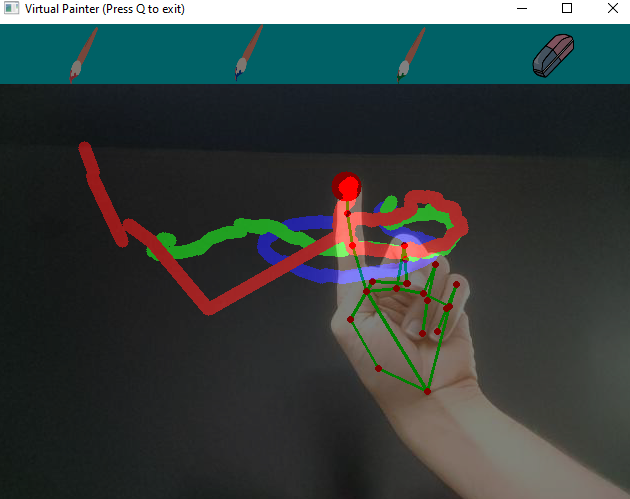

# Virtual-Painter
Virtual painter program using computer vision. Inspired by the freeCodeCamp course on Computer Vision.

This simple program uses the hand tracking module (https://github.com/NikoSilveira/Image-Recognition-Modules/tree/main/1.%20Hand%20Tracking) to scan the positions of the fingertips (index and middle) to selecet between tools/colors and draw on the screen capture itself.

